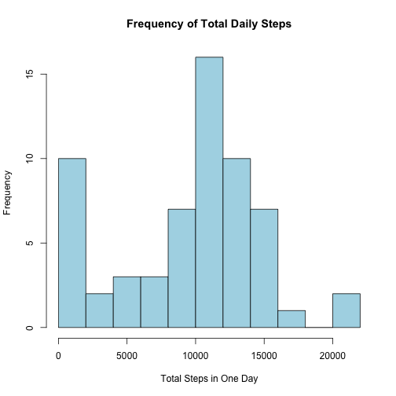
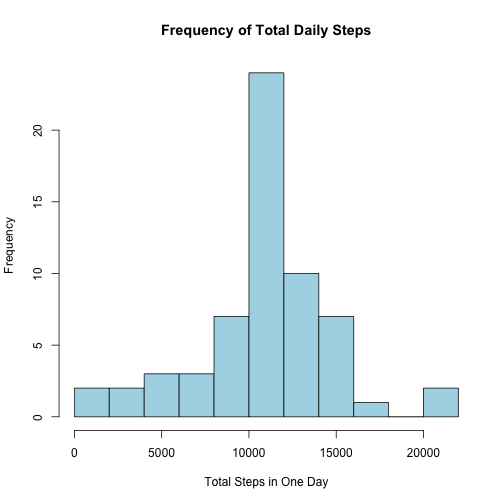
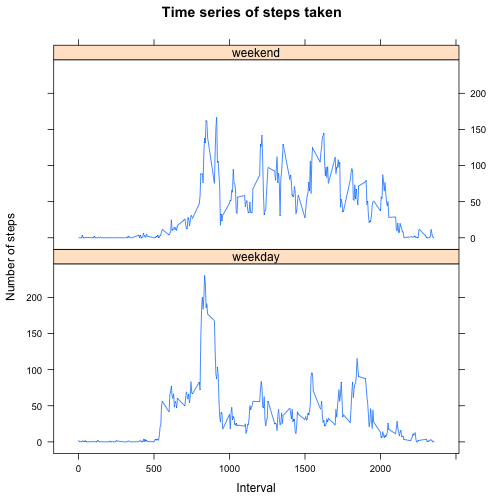

Part 0 - Loading the Data
--------
First, we need to load the data into R, so we use **read.csv** to do so and name the data **df**.

```r
df <- read.csv("activity.csv")
```

Part 1 - Mean Total No. of Steps per Day
-------

Now, we want to plot a histogram of the total number of steps taken each day. We will use the base graphics package to accomplish this. Additionally, we will need to compute the mean and median number of steps taken per day. We can do this using the same code.


```r
library(graphics)
datelist <- levels(df$date)
v <- numeric()
for (i in 1:length(datelist)){
        v <- c(v,sum(df[which(df$date == datelist[i]), 1], na.rm = TRUE))
}
hist(v, breaks = 10, col = "lightblue", 
     main = "Frequency of Total Daily Steps", xlab = "Total Steps in One Day")
```

 

```r
summary(v)
```

```
##    Min. 1st Qu.  Median    Mean 3rd Qu.    Max. 
##       0    6778   10400    9354   12810   21190
```
From our summary, we determine that **the mean number of steps taken per day is 9354 and the median number of steps is 10400**.

Part 2 - Avg Daily Activity Pattern
-------

Now we need to construct a time series plot of the 5-minute intervals averaged over number of steps taken, averaged across all days. Using a for-loop, as before, we create a data frame with those averages paired with the associated interval. Then we simply take the maximum in R to note that **the interval at 835 minutes contains the maximum number of steps on average across all days**.


```r
w <- numeric()
for (i in 1:288) {
        w <- c(w,mean(df[which(df$interval == df[i,3]),1], na.rm = TRUE))
}

timesrs <- cbind(data.frame(w), df[1:288,3])
names(timesrs) <- c("avg_steps", "interval")

plot(timesrs$avg_steps ~ timesrs$interval, type = "l", 
     xlab = "Interval", ylab = "Average Steps", 
     main = "Time Series of Average Steps by Daily Interval")
```

 

```r
timesrs[which(timesrs$avg_steps == max(timesrs$avg_steps)),]
```

```
##     avg_steps interval
## 104  206.1698      835
```

Part 3 - Imputing Missing Values
-------
We can quickly determine how many rows have missing values using **is.na**.

```r
nrow(df[which(is.na(df$steps)),])
```

```
## [1] 2304
```
Now we need to replace those **2304** missing values with something. I think it makes sense to replace these values with the average for that interval. While this (possibly unfairly) assumes that each day involves similar activity, it fits the idea that this anonymous individual operates on a seemingly repeatable schedule.

```r
filleddf <- df
for (i in 1:nrow(df)) {
        if(is.na(df[i,1])) {
                filleddf[i,1] <- timesrs[which(timesrs$interval == df[i,3]),1]
        }
}
nrow(filleddf[which(is.na(filleddf$steps)),])
```

```
## [1] 0
```
Our new data frame, **filleddf**, has no **NA** values in **step**. Now, to create a histogram of the total number of steps taken each day and to find the mean and median, we simply revisit our code from part 1 and replace **df** with **filleddf**.

```r
v1 <- numeric()
for (i in 1:length(datelist)){
        v1 <- c(v1,sum(filleddf[which(df$date == datelist[i]), 1]))
}
hist(v1, breaks = 10, col = "lightblue", 
     main = "Frequency of Total Daily Steps", xlab = "Total Steps in One Day")
```

 

```r
summary(v1)
```

```
##    Min. 1st Qu.  Median    Mean 3rd Qu.    Max. 
##      41    9819   10770   10770   12810   21190
```
**Note that the median and mean have both increased to be 10770, differing from earlier by 370 steps and 1416 steps respectively.** Additionally, it appears the average steps per day is much more centralized. This makes sense, given the way we replaced our missing values. That is, most days tend to have the same number of daily steps now since we assumed that most days would be similar in activity.

Part 4 - Weekends vs. Weekdays
------------
We add a column full of **NA** values to **filleddf** and call the column name week. Then, using **weekdays()**, we iterate over **filleddf** and replace the **NA** with "weekend" if the given day is on the weekend, and "weekday" if the day is a weekday.

```r
newcol <- rep(NA, nrow(filleddf))
filleddf <- cbind(filleddf, newcol)
names(filleddf) <- c("steps", "date", "interval", "week")
for (i in 1:nrow(filleddf)) {
        if((weekdays(as.Date(filleddf[i,2])) == "Saturday") |
                   (weekdays(as.Date(filleddf[i,2])) == "Sunday")) {
                filleddf[i,4] <- "weekend"
        } else {
                filleddf[i,4] <- "weekday"
        }
}
```

Now, we want a panel plot with a time series plot of the 5 minute intervals and the average number of steps taken, averaged across all weekday days or weekend days. We can use our code from part 2 for this. For this plot, we will use the **lattice** library.

```r
library(lattice)
w1 <- numeric()
w2 <- numeric()
weekdays <- filleddf[which(filleddf$week == "weekday"),]
weekends <- filleddf[which(filleddf$week == "weekend"),]
for (i in 1:288) {
        w1 <- c(w1,mean(weekdays[which(weekdays$interval == weekdays[i,3]),1]))
        w2 <- c(w2, mean(weekends[which(weekends$interval == weekends[i,3]),1]))
}

timesrs2 <- cbind(data.frame(c(w1,w2)), rep(filleddf[1:288,3],2), 
                 c(rep("weekday", 288), rep("weekend", 288)))
names(timesrs2) <- c("avg_steps", "interval", "week")

xyplot(avg_steps~interval|week, data = timesrs2, type = "l", 
       ylab = "Number of steps", xlab = "Interval", 
       main = "Time series of steps taken", layout = c(1,2))
```

 

The key difference here is that weekdays tend to have a more concentrated burst of movement in the morning and then tail off for the rest of the day. Weekends have a higher number of steps on average throughout the day, indicating more general activity.
